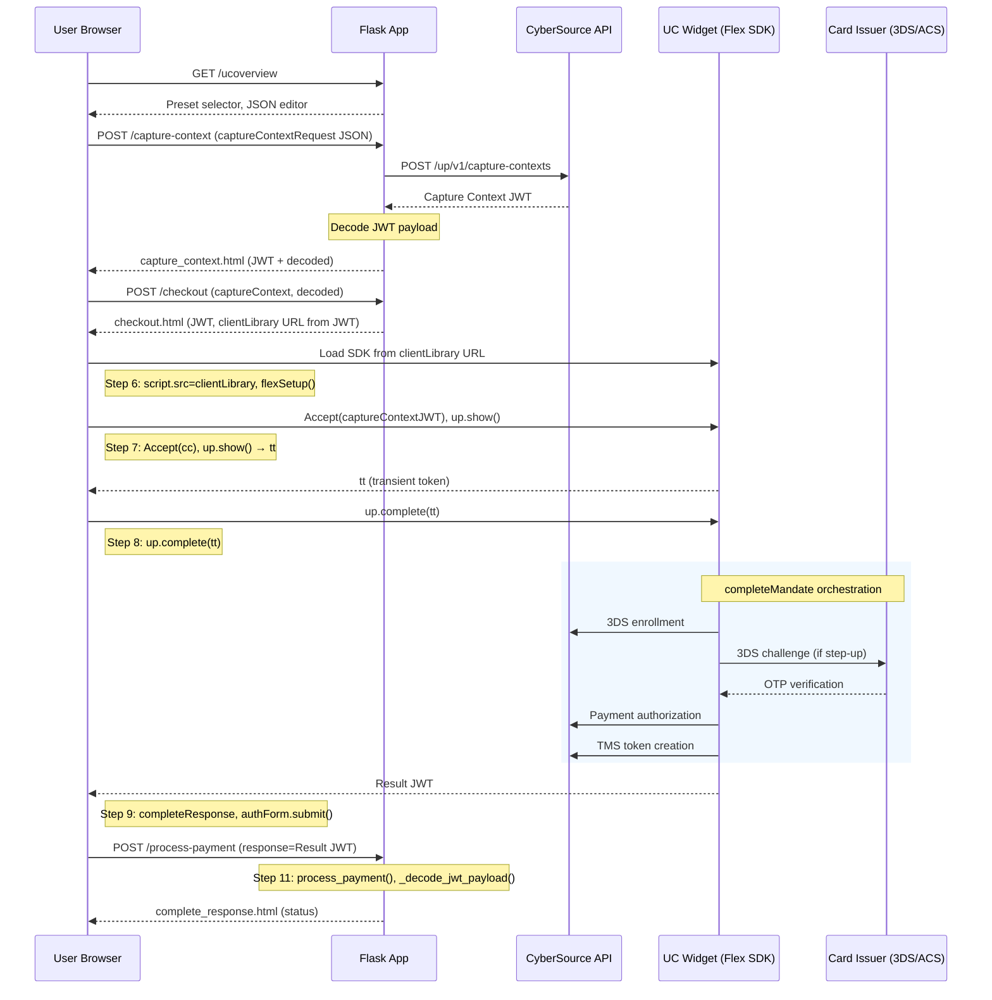

# Unified Checkout API Flow & JWT Sequence Diagram

This document describes the API flow and JWT usage in the CyberSource Unified Checkout Python/Flask application.

---

## Overview

The flow involves three main JWTs:

| JWT | Origin | Purpose |
|-----|--------|---------|
| **Capture Context JWT** | CyberSource API | Configures the UC widget (client library URL, integrity hash, payment types, 3DS settings) |
| **Transient Token (tt)** | UC Widget (`up.show()`) | Encrypted payment data captured by the widget |
| **Result JWT** | UC Widget (`up.complete()`) | Orchestrated payment result (3DS + auth + TMS token) |

---

## Sequence Diagram (ASCII)

```
┌─────────┐       ┌──────────────┐       ┌──────────────┐       ┌─────────────────┐       ┌──────────────┐
│  User   │       │  Flask App   │       │ CyberSource  │       │  UC Widget      │       │  Card Issuer │
│ Browser │       │  (Server)    │       │  API         │       │  (Flex SDK)     │       │  (3DS/ACS)   │
└────┬────┘       └──────┬───────┘       └──────┬───────┘       └────────┬────────┘       └──────┬───────┘
     │                   │                      │                        │                        │
     │ 1. GET /ucoverview│                      │                        │                        │
     │──────────────────>│                      │                        │                        │
     │                   │                      │                        │                        │
     │ 2. Select preset, edit JSON               │                        │                        │
     │   POST /capture-context                   │                        │                        │
     │   (captureContextRequest)                 │                        │                        │
     │──────────────────>│                      │                        │                        │
     │                   │                      │                        │                        │
     │                   │ 3. POST /up/v1/capture-contexts                │                        │
     │                   │    (JSON request)     │                        │                        │
     │                   │─────────────────────>│                        │                        │
     │                   │                      │                        │                        │
     │                   │ 4. Capture Context JWT│                        │                        │
     │                   │<─────────────────────│                        │                        │
     │                   │                      │                        │                        │
     │                   │ 5. Decode JWT payload (_decode_jwt_payload)    │                        │
     │                   │    Extract: ctx[0].data.clientLibrary,        │                        │
     │                   │    clientLibraryIntegrity                      │                        │
     │                   │                      │                        │                        │
     │ 6. capture_context.html (JWT + decoded)   │                        │                        │
     │<──────────────────│                      │                        │                        │
     │                   │                      │                        │                        │
     │ 7. POST /checkout (captureContext, captureContextDecoded)          │                        │
     │──────────────────>│                      │                        │                        │
     │                   │                      │                        │                        │
     │ 8. checkout.html   │                      │                        │                        │
     │   (capture_context JWT, clientLibrary URL from decoded JWT)        │                        │
     │<──────────────────│                      │                        │                        │
     │                   │                      │                        │                        │
     │ 9. Load UC SDK from clientLibrary URL (from JWT)                   │                        │
     │──────────────────────────────────────────────────────────────────>│                        │
     │                   │                      │                        │                        │
     │                   │                      │  10. Accept(captureContextJWT)                   │
     │                   │                      │      up = accept.unifiedPayments()              │
     │                   │                      │      tt = up.show()  [captures card]            │
     │                   │                      │<───────────────────────────────────────────────│
     │                   │                      │                        │                        │
     │                   │                      │  11. up.complete(tt) orchestrates:              │
     │                   │                      │      • 3DS enrollment check                     │
     │                   │                      │      • [if step-up] 3DS challenge                │
     │                   │                      │────────────────────────────────────────────────>│
     │                   │                      │                        │    OTP/Challenge       │
     │                   │                      │                        │<──────────────────────>│
     │                   │                      │      • Payment authorization                    │
     │                   │                      │      • TMS token creation                        │
     │                   │                      │<───────────────────────────────────────────────│
     │                   │                      │                        │                        │
     │                   │                      │  12. Result JWT (completeResponse)               │
     │                   │                      │                        │                        │
     │ 13. POST /process-payment (response=Result JWT)                    │                        │
     │──────────────────>│                      │                        │                        │
     │                   │                      │                        │                        │
     │                   │ 14. Decode Result JWT (_decode_jwt_payload)     │                        │
     │                   │     Extract: status, paymentStatus, id         │                        │
     │                   │                      │                        │                        │
     │ 15. complete_response.html (AUTHORIZED/DECLINED/ERROR)             │                        │
     │<──────────────────│                      │                        │                        │
     │                   │                      │                        │                        │
```

---

## JWT Flow Summary

### 1. Capture Context JWT (from CyberSource)

- **Request:** `POST /capture-context` with `captureContextRequest` JSON
- **API Call:** `UnifiedCheckoutCaptureContextApi.generate_unified_checkout_capture_context()` → CyberSource `/up/v1/capture-contexts`
- **Response:** JWT string (header.payload.signature)
- **Payload contents:** `ctx[0].data.clientLibrary`, `clientLibraryIntegrity`, payment config, 3DS settings
- **Decoding:** `_decode_jwt_payload()` extracts payload (base64 decode second segment) for display and to get SDK URL

### 2. Transient Token (tt) – Internal to Widget

- **Created by:** `up.show()` after user enters payment data
- **Use:** Passed to `up.complete(tt)` to trigger orchestration
- **Not decoded by our app:** Used only by the UC widget

### 3. Result JWT (from UC Widget)

- **Created by:** `up.complete(tt)` after orchestration completes
- **Contains:** `status`, `paymentStatus`, `orderStatus`, `id`, `transactionId`, auth result, TMS token
- **Submitted:** Form POST to `/process-payment` with `response` = Result JWT
- **Decoding:** `_decode_jwt_payload()` extracts payload for display and status

---

## Embedded Mermaid Diagram



---

## Functions Involved (Step 6 onwards)

| Step | Location | Function / Code |
|------|----------|-----------------|
| **6** | `templates/checkout.html` | Script loading via `script.src = clientLibrary`, `script.integrity = clientLibraryIntegrity` (from decoded JWT `ctx[0].data`) |
| **7** | `templates/checkout.html` | `flexSetup()`, `Accept(cc)`, `accept.unifiedPayments(sidebar)`, `up.show(showArgs)` → returns `tt` |
| **8** | `templates/checkout.html` | `up.complete(tt)` — Flex SDK orchestrates 3DS → auth → TMS |
| **9** | `templates/checkout.html` | `completeResponse = await up.complete(tt)`, `response.value = completeResponse`, `authForm.submit()` |
| **10** | `templates/checkout.html` | Form `<form action="/process-payment" method="post">` with `<input name="response"/>`; `authForm.submit()` |
| **11** | `app.py` | `process_payment()` — `request.form.get("response")`, `_decode_jwt_payload(widget_response)`, `render_template("complete_response.html", ...)` |
| **11** | `app.py` | `_decode_jwt_payload(jwt_token)` — base64 decode JWT payload (second segment) |

### Step 6: Load UC SDK
- **File:** `templates/checkout.html`
- `clientLibrary` and `clientLibraryIntegrity` come from decoded JWT passed by `checkout()` route

### Step 7: Widget Accept → show → tt
- **File:** `templates/checkout.html`
- `flexSetup()` — async, runs when SDK loads
- `Accept(cc)` — Flex SDK init with capture context JWT
- `accept.unifiedPayments(sidebar)` — returns UC instance
- `up.show(showArgs)` — displays payment UI, returns `tt` (transient token)

### Step 8: Orchestration
- **File:** `templates/checkout.html`
- `up.complete(tt)` — Flex SDK orchestrates 3DS, auth, TMS (no app-side functions)

### Step 9–10: Submit Result JWT
- **File:** `templates/checkout.html`
- `completeResponse = await up.complete(tt)`, `response.value = completeResponse`, `authForm.submit()`
- Form POST to `/process-payment` with `response` = Result JWT

### Step 11: Decode and Display
- **File:** `app.py`
- `process_payment()` — `request.form.get("response")`, `_decode_jwt_payload()`, `decoded.get("status")`, `render_template("complete_response.html", ...)`
- `_decode_jwt_payload(jwt_token)` — base64 decode payload without verification

---

## Key Code References

| Step | File | Function/Route |
|------|------|----------------|
| Decode JWT | `app.py` | `_decode_jwt_payload()` |
| Capture Context API | `app.py` | `capture_context()` → `UnifiedCheckoutCaptureContextApi` |
| Extract clientLibrary from JWT | `app.py` | `checkout()` reads `decoded_data["ctx"][0]["data"]["clientLibrary"]` |
| Step 6: Load SDK | `templates/checkout.html` | `script.src = clientLibrary`, `script.integrity = clientLibraryIntegrity` |
| Step 7: Widget init | `templates/checkout.html` | `flexSetup()`, `Accept(cc)`, `up.show()` |
| Step 8: Orchestration | `templates/checkout.html` | `up.complete(tt)` |
| Step 9–10: Submit | `templates/checkout.html` | `authForm.submit()` → POST `/process-payment` |
| Step 11: Result processing | `app.py` | `process_payment()` decodes `response` JWT |
